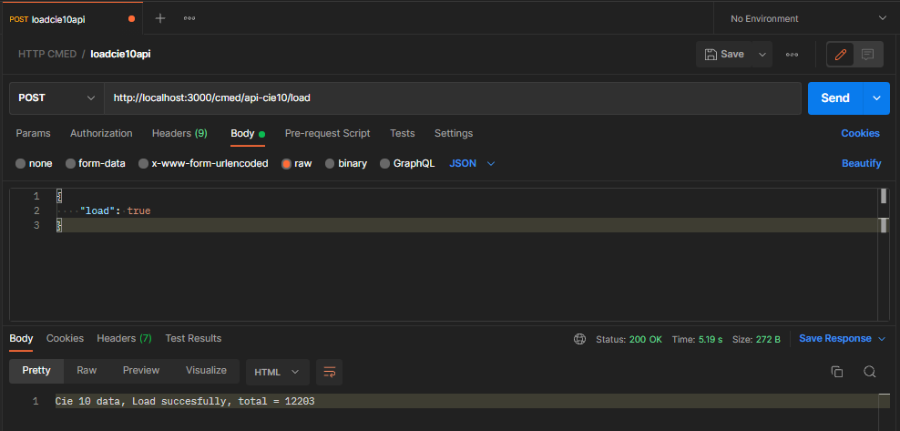

# cie10-rest-api

This is a rest API for cie10 standard (spanish)

For POST CIE10 data on your mongodb database use a HTTP request to __http://localhost:3000/cmed/api-cie10/load__ with body:

```
{
    "load": true
}
```


